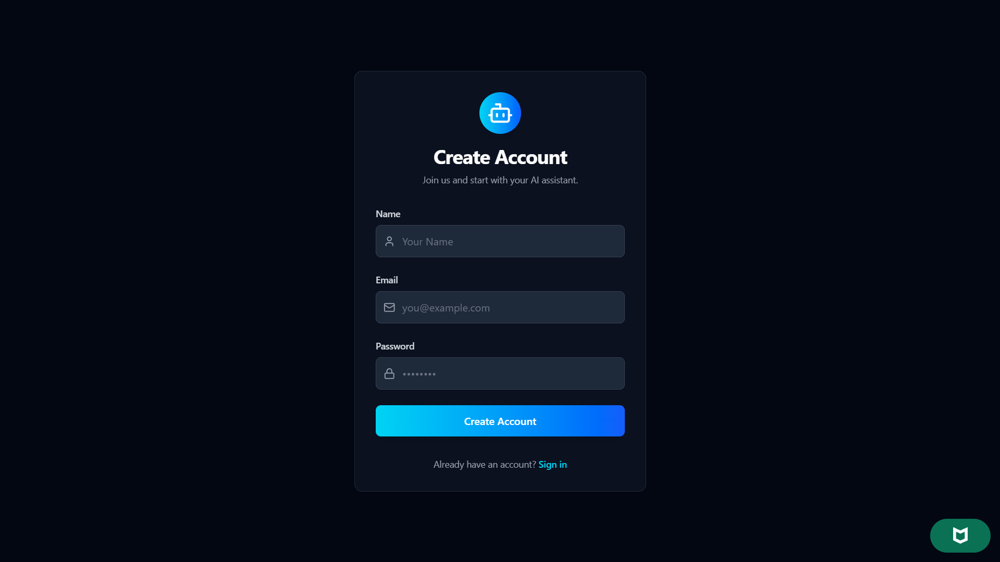
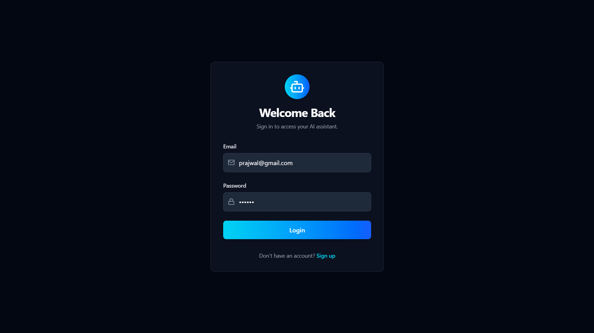
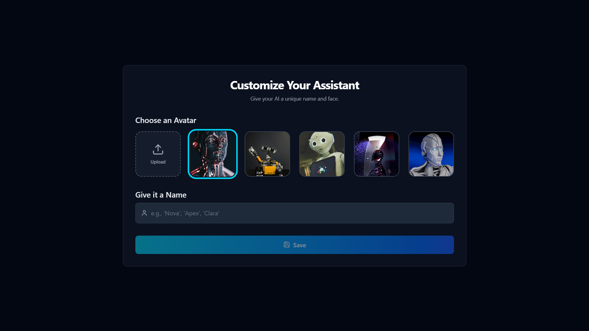
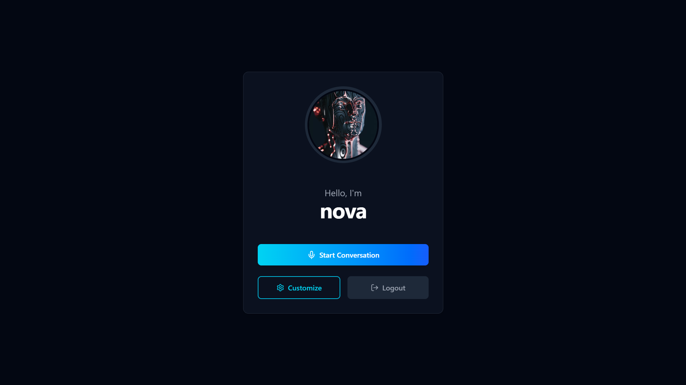
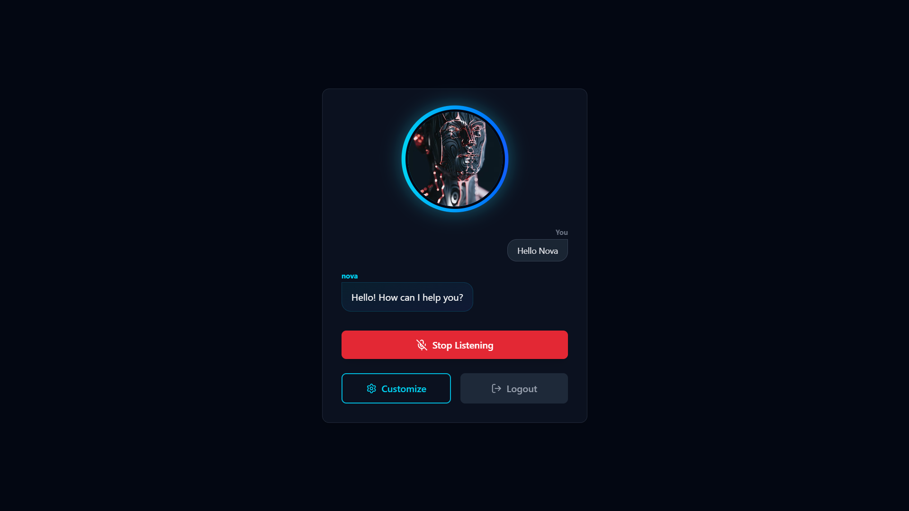
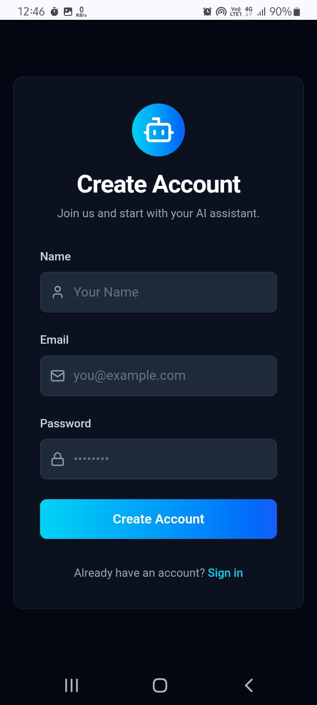
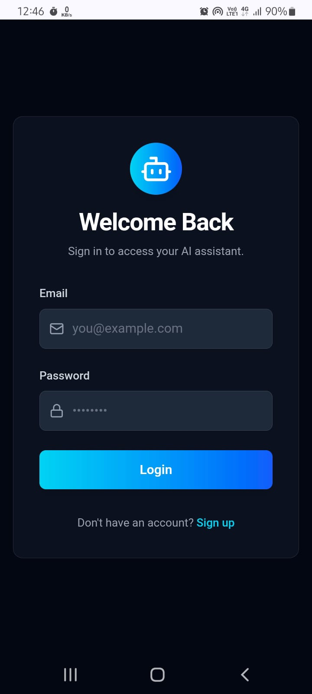
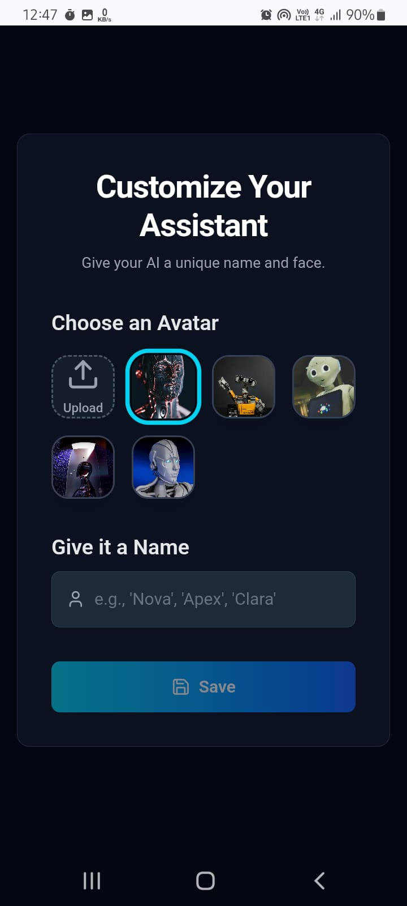
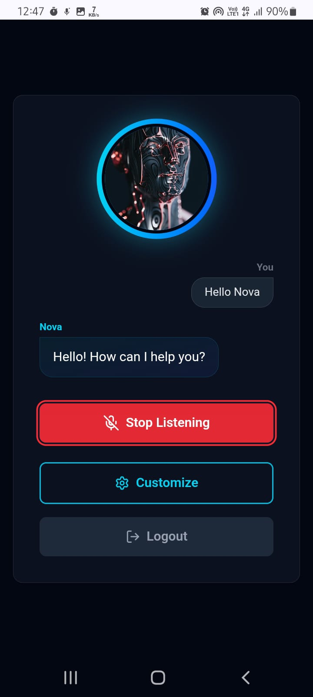

# AI Virtual Assistant 🤖✨


**AI Virtual Assistant** is a next-generation productivity tool designed specifically for developers and tech enthusiasts. Powered by Google's **Gemini AI**, this assistant goes beyond simple chat—it acts as a command center for your digital life.

Whether you need to launch daily applications like **LeetCode**, **WhatsApp**, or **Instagram**, or you need intelligent answers to complex queries, this assistant handles it all through a seamless voice and text interface. It features complete user customization, allowing you to personalize your assistant's identity and appearance.

---

## 🌟 Key Features

### 🧠 Intelligent Core
* **Powered by Gemini AI**: Utilizes the advanced `gemini-2.5-flash` model for rapid, context-aware responses.
* **Natural Language Processing**: Understands intent, allowing for conversational interactions rather than rigid commands.

### 🚀 App Automation
* **Smart App Launcher**: Open limited external applications directly from the chat interface.
* **Developer Focused**: tailored integration for apps used in a coder's daily life (e.g., **LeetCode**, **YouTube**, **WhatsApp**, **Instagram**).

### 🎨 Personalization & UI
* **Customizable Assistant**: Give your AI a unique name and personality.
* **Dynamic Avatars**: Choose from default avatars or upload your own custom image.
* **Cloud Storage**: Custom avatars are securely uploaded and served via **Cloudinary**.
* **Responsive Design**: A sleek, mobile-first interface built with **Tailwind CSS** and **React**.

### 🛡️ Security & Auth
* **Secure Authentication**: Robust login system using **JWT (JSON Web Tokens)**.
* **Data Protection**: Passwords are hashed and salted using **Bcrypt**.
* **Protected Routes**: Middleware ensures only authenticated users can access specific features.

---

## 🛠️ Tech Stack

This project is built using the **MERN** stack, leveraging modern tools for performance and scalability.

| Area | Technologies |
| :--- | :--- |
| **Frontend** |     |
| **Backend** |    |
| **Database** |  |
| **Cloud & AI** |   |

---

## 📸 Screenshots

Here is a glimpse of the AI Virtual Assistant in action.

### **Desktop View**

| Register | Login | Customization | Home | Home (Chat) |
| :---: | :---: | :---: | :---: | :---: |
|  |  |  |  |  |

### **Mobile View**

| Register | Login | Customization | Home |
| :---: | :---: | :---: | :---: |
|  |  |  |  |

---

## ⚙️ Environment Variables

To run this project, you will need to add the following environment variables to your `.env` file in the **backend** directory.

> **⚠️ Security Warning:** The keys below are templates. **Never** commit your actual API keys (like `MONGO_URI` or `API_KEY`) to GitHub. Use a `.env` file and add it to `.gitignore`.

```env
# Server Configuration
PORT=8000

# Database Connection (MongoDB Atlas)
MONGO_URI=mongodb+srv://<YOUR_USERNAME>:<YOUR_PASSWORD>@cluster0.mongodb.net/ai-virtual-assistant-db?retryWrites=true&w=majority

# Security (JWT)
JWT_SECRET=your_super_secret_jwt_key

# Cloudinary Configuration (For Avatar Uploads)
CLOUD_NAME=your_cloud_name
API_KEY=your_cloudinary_api_key
API_SECRET=your_cloudinary_api_secret

# Google Gemini AI Configuration
GEMINI_API_URL=[https://generativelanguage.googleapis.com/v1beta/models/gemini-2.5-flash:generateContent?key=YOUR_GEMINI_API_KEY](https://generativelanguage.googleapis.com/v1beta/models/gemini-2.5-flash:generateContent?key=YOUR_GEMINI_API_KEY)

```
🚀 Getting Started
Follow these steps to set up the project locally on your machine.

```Prerequisites
Ensure you have the following installed:

Node.js (v16 or higher)
npm or yarn
MongoDB (Local or Atlas)
```

Installation
```Clone the Repository
git clone https://github.com/Prajwal-dev-dsa/AI_VIRTUAL_ASSISTANT_MERN.git
cd AI_VIRTUAL_ASSISTANT_MERN
```

Backend Setup

```Navigate to the backend directory:

cd backend
Install dependencies:
npm install
Create a .env file in the backend root and configure your variables (see the Environment Variables section above).
```

Frontend Setup

```Navigate to the frontend directory:

cd ../frontend
Install dependencies:
npm install
Running the Application
Start the Backend Server

# Inside the backend folder
npm run dev

Start the Frontend Client

# Inside the frontend folder
npm run dev

The application should now be running at http://localhost:5173 (or your configured frontend port).
```
